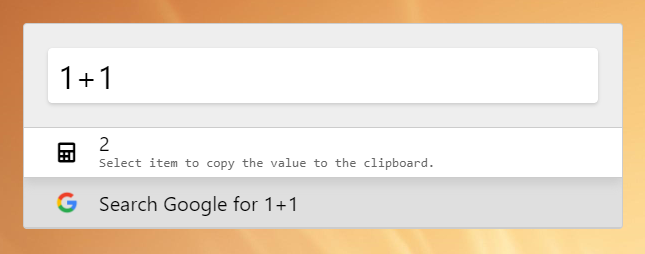

## Fabric Theme

A Zazu theme inspired by Microsoft's Office UI Fabric.

> NOTE: Only tested on Windows 10



## Installing

Specify `vivekhnz/zazu-fabric-theme` inside of your `~/.zazurc.json` file.

``` json
{
  "theme": "vivekhnz/zazu-fabric-theme"
}
```

## Building

```
npm install
npm run build
```
